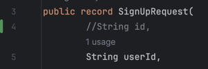

# be-spring-cafe

2025 마스터즈 백엔드 스프링 카페


## 문제해결
### 1. 사용자 리스트를 조회할 때 사용자 id가 출력되지 않는 문제
  - 원인
    - 회원가입할 때 form.html의 input 태그의 name 속성의 값 `userId`와
      
    - request dto의 필드명을 맞춰주지 않아서 null이 할당되고 결국 `User` 객체의 userId 필드에 null 값이 들어감
  

  - 해결
    - request dto의 필드명을 `userId`로 변경
    - `User` 객체의 userId 필드에 값이 잘 들어가서 출력되어짐

### 2. `WebMvcConfigurer`의 `addViewControllers`와 `@Controller` 간의 URL 매핑 충돌
- 오류 메시지
```
HttpRequestMethodNotSupportedException: 
Request method 'POST' is not supported]
```

- 원인
  - `WebMvcConfigurer`의 `addViewControllers`는 GET 요청만 처리하기 때문에 같은 URL에 대한 POST 요청 처리 불가
- 해결
  - form 표시와 form 처리에 다른 URL 패턴 사용
    - `GetMapping` URL : `/users/join`
    - `PostMapping` URL : `/users/signUp`
### 3. 경로 변수 타입 변환 오류
- 오류 메시지
```
MethodArgumentTypeMismatchException: 
Method parameter 'userSeq': Failed to convert value of type 'java.lang.String' to required type 'java.lang.Long'; For input string: "join"
```

- 원인
  - `/users/join` 요청(회원가입 폼 표시 요청)이 `/users/{userSeq}` 패턴(프로필 조회 요청)과 매칭되어 문자열을 Long으로 변환 시도
- 해결
  - `WebMvcConfigurer`에 `registry.setOrder(Ordered.HIGHEST_PRECEDENCE);`를 추가하여 `/users/join`의 우선순위를 높임
 