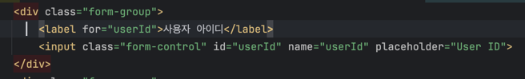

# be-spring-cafe

2025 마스터즈 백엔드 스프링 카페

# 목차
1. [1단계](#1단계)
2. [2단계](#2단계)
3. [3단계](#3단계)
4. [4단계](#4단계)
5. [5단계](#5단계)
6. [6단계](#6단계)
# 1단계
## 문제해결
### 1. 사용자 리스트를 조회할 때 사용자 id가 출력되지 않는 문제
  - 원인
    - 회원가입할 때 form.html의 input 태그의 name 속성의 값 `userId`와
    - 
    - request dto의 필드명을 맞춰주지 않아서 null이 할당되고 결국 `User` 객체의 userId 필드에 null 값이 들어감


  - 해결
    - request dto의 필드명을 `userId`로 변경
    - `User` 객체의 userId 필드에 값이 잘 들어가서 출력되어짐

### 2. `WebMvcConfigurer`의 `addViewControllers`와 `@Controller` 간의 URL 매핑 충돌
- 오류 메시지
```
HttpRequestMethodNotSupportedException: 
Request method 'POST' is not supported]
```

- 원인
  - `WebMvcConfigurer`의 `addViewControllers`는 GET 요청만 처리하기 때문에 같은 URL에 대한 POST 요청 처리 불가
- 해결
  - form 표시와 form 처리에 다른 URL 패턴 사용
    - `GetMapping` URL : `/users/join`
    - `PostMapping` URL : `/users/signUp`
### 3. 경로 변수 타입 변환 오류
- 오류 메시지
```
MethodArgumentTypeMismatchException: 
Method parameter 'userSeq': Failed to convert value of type 'java.lang.String' to required type 'java.lang.Long'; For input string: "join"
```

- 원인
  - `/users/join` 요청(회원가입 폼 표시 요청)이 `/users/{userSeq}` 패턴(프로필 조회 요청)과 매칭되어 문자열을 Long으로 변환 시도
- 해결
  - `WebMvcConfigurer`에 `registry.setOrder(Ordered.HIGHEST_PRECEDENCE);`를 추가하여 `/users/join`의 우선순위를 높임

## 피드백
- 아래의 코드는 정상적으로 동작하지 않을 가능성이 있다.
```java
@Override
    public void save(User user) {
        user.setSeq(++sequence);
        store.put(user.getSeq(), user);
    }
```
"정상적으로 동작하지 않을 가능성이 있다" - 이 피드백을 "동시성 문제가 일어날 가능성이 있다"라고 이해했다.
- 문제 부분  
  `private static Long sequence`, `private static final Map<Long, User> store = new HashMap<>();`
- 시도 방법  
  `Long` 에서 `AtomicLong`, `HashMap`에서 `ConcurrentHashMap`으로 수정

## 고민
- 문제 해결 2번에서 말했던 것처럼 `WebMvcConfigurer`의 `addViewController(/users/join)`와 `@Controller`의 `@PostMapping("/users/signUp")`의 URL을 맞추고 싶었지만 `WebMvcConfigurer`에 `registry.setOrder(Ordered.HIGHEST_PRECEDENCE);`로 우선순위를 높게 설정해두어서 충돌이 발생하여 POST 요청이 거부되었다.
  - 호눅스께 여쭤보니 URL을 맞추는 것은 REST API 스타일이고 지금 하는 것은 템플릿 엔진이니 URL을 맞추지 않아도 된다는 답변을 받아 그냥 분리된 상태로 진행하려고 한다.


# 2단계
## 구현 내용
- 글쓰기
- 글 목록 조회
- 게시글 상세 조회
- 회원정보 수정
  - 비밀번호 요구사항 추가(대문자, 특수문자, 숫자 최소 1개, 8자 이상)
- `.editorconfig` 파일을 추가하여 각 파일 끝에 개행 자동 추가

## 피드백
## 고민
- TDD를 하고 싶기도 하고 테스트 코드를 짜고 싶어서 Spring을 테스트하는 방법에 대해 잠시 학습했다. 하지만 Spring도 모르는데 테스트를 학습하는 것은 순서가 맞지 않는 것 같고 이해하기도 힘들어서 우선 스프링에 대해 학습하려고 한다.

# 3단계
## 구현 내용
- db 연결
- 배포   
[url](http://3.34.2.22:8080/)
```
http://3.34.2.22:8080/
```
- 배포 방법  
1. 프로젝트 빌드
```
./gradlew clean build
```
2. [scp](#SCP)를 사용하여 ec2 인스턴스로 build된 jar 파일 전송
```
scp -i [pem 경로] [jar파일 경로] ubuntu@your-ec2-public-dns:~/
```
3. [ssh](#SSH)로 ec2 인스턴스 접속
4. ec2 인스턴스 전용 `application.yaml` 파일 생성
   - H2 파일 모드 사용
5. 애플리케이션 실행
```
java -jar codestagram-0.0.1-SNAPSHOT.jar --spring.config.location=file:./config/application.yaml
// 쉘 스크립트 사용하여 스크립트로 실행
```

## 고민
- 현재 User의 실제값과 기댓값의 참조값이 달라 값을 꺼내서 비교하고 있는데 User 클래스에 hashcode와 equals를 오버라이딩해서 동등성 비교를 해도 적절한건지 의문

## 문제 해결
- 문제  
     
회원정보 수정 버튼을 눌렀을 때 404가 에러가 떳다.   
의도대로라면 `localhost:8080/users/{userSeq}`로 가서 `PUT` 요청을 처리해야 하지만 `localhost:8080/users/` 까지만 되어 요청을 처리하지 못하고 404가 터진 것이다. 


  
수정 폼의 html을 보니 form 태그의 action 속성의 값을 보면 `"/users/"`까지만 적혀 있는 것을 볼 수 있다.

- 원인  
아래의 사진은 UserService의 update 메서드이다.  
  

첫 번째 줄은 findUser로 기존의 유저를 조회하는 로직인데, 당시에 사용중이던 JdbcUserRepository 구현체에서 유저 정보를 가져와 User 객체를 생성할 때 setSeq를 하지 않아  Model로 넘어가는 User에 seq 값이 없어 action 속성의 값이 `"/users/"`가 된 것이였다.  
  
- 해결  
JdbcUserRepository의 findById 메서드에서 User 객체를 생성한 후에 setSeq로 seq 값을 지정해줌으로써 `"users/{userSeq}"`로 요청을 잘 처리할 수 있었다.
  
  

# 4단계
- 구현
  - User와 Article 간의 1 : N 매핑
  - 로그인
  - 로그아웃
  - 개인정보 수정(본인의 것만)

# 5단계
- 구현
  - 로그인한 사용자만 게시글 세부내용 조회
  - 로그인한 사용자만 게시글 작성
  - 로그인한 사용자만 자신의 글 수정 및 삭제
  - 세션에 User 객체 저장 방식에서 User의 id를 저장하는 방식으로 변경
  - 본인 계정만 수정 버튼 보이도록 수정
  - 본인 게시글만 수정 및 삭제 버튼 보이도록 수정
  - 회원가입 후 로그인 유지되게끔 수정
  - 엔티티에서 setter를 제거하고 명확한 이름을 가진 메서드 생성하여 수정 처리
  - Article 엔티티에 등록일 필드 추가
  - 로그아웃 요청 변경 (GET -> POST)

# 6단계
- 구현
  - 123

# 학습
### PRG 패턴 (POST-REDIRECT-GET)
- 기본 동작
  1. 사용자가 폼을 제출하면 서버로 POST 요청 전송
  2. 서버는 POST 요청을 처리한 후 사용자에게 특정 URL로 Redirect 응답 보냄
  3. 브라우저는 자동으로 리다이렉트 지시를 따라 지정된 URL로 GET 요청
  4. 서버는 GET 요청에 대한 응답으로 최종 결과 페이지를 제공
- 필요성
  - 새로고침 문제
     - POST 요청을 처리한 후 바로 결과 페이지를 보여주면, 사용자가 새로고침을 했을 때 브라우저는 동일한 POST 요청을 다시 서버로 보냄
     - 이로 인해 같은 작업이 중복 실행될 수 있음
     - POST-Redirect-GET 패턴을 사용하면 새로고침 시 마지막 GET 요청만 다시 실행되므로 POST 작업이 중복되지 않음
- 멱등성
  - 같은 요청을 여러 번 보내더라도 결과가 변하지 않는 성질
  - GET, PUT, DELETE는 멱등성을 가지지만 POST는 가지지 않음

### RedirectAttributes
- Spring MVC에서 리다이렉트 시 데이터를 전달하기 위한 인터페이스
- POST 요청 처리 후 브라우저를 다른 URL로 리다이렉트할 때 유용

- 메서드
  1. `addAttribute(String name, Object value)`: URL 파라미터로 데이터 전달
     - 데이터가 URL에 노출
     - 문자열, 숫자와 같은 간단한 데이터에 적합
     - ex) `/users?message=success`
  2. `addFlashAttribute(String name, Object value)`: 세션에 데이터 임시 저장
     - 데이터가 URL에 노출되지 않음
     - 리다이렉트 후 한 번만 사용 가능(읽은 후 자동 삭제)
     - ex) 성공/실패 메시지, 폼 입력값
- `addFlashAttribute` 동작 방식
  - `addFlashAttribute`를 사용할 때 Spring은 `FlashMap` 사용
  1. 리다이렉트 전: 데이터를 `FlashMap`에 저장
  2. `FlashMap`을 세션에 임시 저장
  3. 리다이렉트 후: Spring은 자동으로 `FlashMap`을 확인하고 데이터를 모델에 추가
  4. 데이터가 사용된 후에는 `FlashMap`에서 자동으로 삭제
  
### HTTP 세션(Session)
- 웹 개발에서 세션은 서버가 클라이언트의 상태 정보를 일정 시간 동안 유지하는 메커니즘
- 웹의 근본적인 특성인 "무상태성(Statelessness)"의 한계를 극복하기 위해 필수적인 개념

- 무상태성
  - 각 요청이 이전 요청과 완전히 독립적으로 처리
- 작동 방식
  1. 세션 생성: 사용자가 웹사이트에 처음 접속하면 서버는 고유한 세션 ID 생성
  2. 세션 ID 전달: 세션 ID는 일반적으로 일반적으로 쿠키(Cookie)를 통해 클라이언트(브라우저)에 전달. 이 쿠키의 이름은 보통 'JSESSIONID'(Java 애플리케이션) 또는 `PHPSESSID`(PHP 애플리케이션) 등으로 지정
  3. 상태 정보 저장: 서버는 세션 ID와 연결된 데이터 저장소(세션 저장소)를 생성하고, 이곳에 사용자 관련 정보를 저장
  4. 후속 요청에서의 세션 식별: 사용자가 같은 웹사이트에 추가 요청을 보낼 때마다, 브라우저는 자동으로 세션 ID가 포함된 쿠키를 함께 전송
  5. 세션 데이터 접근: 서버는 이 세션ID를 사용하여 해당 사용자의 데이터를 찾고, 요청 처리에 활용
  6. 세션 만료: 일정 시간 동안 활동이 없으면 세션은 만료되고, 관련 데이터는 서버에서 제거

### HTTP 쿠키(Cookie)
- 서버가 사용자의 웹 브라우저에 저장하는 텍스트 데이터
- 데이터는 이름-값 쌍의 형태를 가지며, 브라우저는 특정 웹사이트에 요청을 보낼 때마다 해당 웹사이트에 대해 저장된 쿠키를 함께 전송

- 작동 방식
  1. 쿠키 생성: 서버가 HTTP 응답의 `Set-Cookie` 헤더를 통해 브라우저에 쿠키를 설정하도록 지시
  2. 쿠키 저장: 브라우저는 이 쿠키를 받아 로컬 스토리지에 저장. 모든 쿠키는 특정 도메인과 경로에 연결됨
  3. 쿠키 전송: 사용자가 동일한 도메인에 다시 요청을 보낼 때, 브라우저는 자동으로 모든 관련 쿠키를 `Cookie` 헤더에 포함시켜 서버로 전송
  4. 쿠키 접근: 서버는 요청에 포함된 쿠키를 읽고 사용자나 세션 식별등의 목적으로 활용
  5. 쿠키 만료: 쿠키는 설정된 만료 시간에 도달하거나 사용자가 수동으로 삭제할 때까지 브라우저에 유지

- 구성 요소
  1. 이름(Name)과 값(Value): 쿠키의 기본 데이터 구성 요소
```name=value```
  2. Domain: 쿠키가 어떤 도메인에 속하는지 지정. 이 속성이 설정되면, 해당 도메인과 그 서브도메인에 대한 요청에만 쿠키가 전송
```Domain=example.com```
  3. Path: 쿠키가 적용되는 서버의 경로를 지정. 예를 들어, `/admin`으로 설정하면 `/admin` 및 그 하위 경로에 대한 요청에만 쿠키가 전송
```Path=/admin```
  4. Expires/Max-Age: 쿠키으 수명을 정의. `Expires`는 정확한 만료 날짜, `Max-Age`는 생성 후 쿠키가 유지될 초 단위 시간을 지정
```Expires=Wed, 21 Oct 2023 07:28:00 GMT Max-Age=3600```
  5. Secure: 이 플래그가 설정된 쿠키는 HTTPS 연결을 통해서만 서버로 전송
```Secure```
  6. HttpOnly: 이 플래그가 설정된 쿠키는 JavaScript를 통해 접근할 수 없어, XSS(Cross-Site-Scripting) 공격으로부터 보호
```HttpOnly```
  7. SameSite: 쿠키가 크로스-사이트 요청에 포함될지 여부를 결정. 값으로는 `Strict`, `Lax`, `None`이 있음
```SameSize=Strict```
- 쿠키 종류(수명)
  1. 세션 쿠키(Session Cookies): 만료 시간을 설정하지 않은 쿠키로, 브라우저 세션이 끝나면(브라우저를 닫으면) 자동으로 삭제. 주로 로그인 세션 유지 등에 사용
  2. 영속적 쿠키(Persistent Cookies): 특정 만료 시간(`Expires` or `Max-Age`)이 설정된 쿠키로, 그 시간이 지나기 전까지는 브라우저를 닫았다 열어도 유지. 사용자 선호도 저장, "로그인 상태 유지" 기능 등에 사용

### SSH
- SSH(Secure Shell)는 네트워크를 통해 원격 컴퓨터에 안전하게 접속하고 명령을 실행할 수 있도록 설계된 암호화된 프로토콜  
- 주로 원격 서버 관리, 파일 전송, 터널링 등에 사용

- 필요성
  - 과거에는 Telnet 같은 프로토콜이 사용되었지만, 데이터가 암호화되지 않고 평문으로 전송되었기 때문에 해킹 위험이 큼
  - SSH는 이를 해결하기 위해 모든 통신을 암호화하여 보안성을 높임
- 원격 접속 방법
```
ssh 사용자이름@서버주소
```
ex) 
```
ssh ubuntu@192.168.1.10
// ubuntu 계정으로 192.168.1.10 서버에 접속
```


### SCP
- Secure Copy Protocol의 약자   
- SSH 기반의 파일 복사 프로토콜로, 원격 서버와 파일을 안전하게 전송할 수 있음
  - SSH를 이용하므로 암호화되어 보안성이 높음
  - `scp` 명령어를 사용하여 로컬 <-> 원격 서버 같 파일 복사 가능
- 사용법
```
scp [옵션] [보낼 파일 경로] [사용자@서버주소:목적지 경로]
```
ex) 로컬에서 원격 서버로 파일 전송
```
scp localfile.txt ubuntu@192.168.1.10:/home/ubuntu/
// localfile.txt를 192.168.1.10 서버의 /home/ubuntu/ 디렉토리에 전송
```
